<h1 align="center">Hi there 👋, I'm Ibad Khan</h1>
<h3 align="center">A passionate React-js Developer from Hyderabad, Sindh, Pakistan</h3>

---

### 🧑‍💻 About Me
I'm a Software Engineering student with a strong focus on building responsive and interactive front-end applications using **React.js**. I enjoy turning ideas into user-friendly interfaces and am currently on the path to becoming a **MERN Stack Developer**.

> *"Code is like poetry — it’s meant to be clean, expressive, and shared."*

---

### 🛠️ Tech Stack

  
  
  
  
  
  

---

### 🚀 Projects I’m Proud Of
- 💱 **Currency Converter App** – A simple and sleek currency converter that supports 180+ countries using a public currency conversion API
- ❌⭕ **Tic Tac Toe Game** – A fun and interactive two-player game built with React for practicing state management and conditional rendering

---

### 🚀 Featured Projects
| Project | Description | Tech |
|--------|-------------|------|
|- 💱 **Currency Converter App**|  A simple and sleek currency converter that supports 180+ countries using a public currency conversion API | `HTML`, `CSS`, `JavaScript`,`API` |
|  ❌⭕ **Tic Tac Toe Game**  | A fun and interactive two-player game built with React for practicing state management and conditional rendering | `HTML`, `CSS`,`JAVASCRIPT` |

---

### 🧩 Fun Facts & Hobbies
- 🎨 I love designing clean UIs before coding them  
- 🎧 Music helps me debug faster  
- ✍️ I occasionally write down thoughts about tech & learning  
- 📚 I enjoy learning through documentation more than tutorials
  

---

### 🌱 What I’m Learning Now
- Node.js & Express.js (Backend fundamentals)
- MongoDB (Database for full-stack development)
- Building RESTful APIs

---

### ⚙️ My Workflow

```mermaid
graph TD;
  Code[💻 Code in VSCode] --> Git[🔧 Commit with Git];
  Git --> Push[☁️ Push to GitHub];
  Push --> Deploy[🚀 Deploy on Vercel/Netlify];
  Deploy --> Share[📢 Share with the world!];
```

### 📚 My Dev Reading List
- [Eloquent JavaScript](https://eloquentjavascript.net/)
- [The Road to React](https://www.roadtoreact.com/)
- [You Don’t Know JS Yet](https://github.com/getify/You-Dont-Know-JS)

---

### 💡 Visitors Counter

  

---

### 🕓 GitHub Contribution Calendar

---

---

### 🎯 2025 Goals
- 🚀 Deploy my first full-stack MERN app
- 📈 Contribute to open-source projects
- ✍️ Write blogs on React and JavaScript
- 🏆 Master Data Structures & Algorithms

---

### 📫 How to Reach Me
- 📧 Email: ibadkhansherani@gmail.com  
- 💬 LinkedIn: www.linkedin.com/in/ibad-khan-a64494283

---

### 📊 GitHub Stats

  
  
  

---

<h3 align="center">“Dream it. Code it. Ship it.” 🚀</h3>

